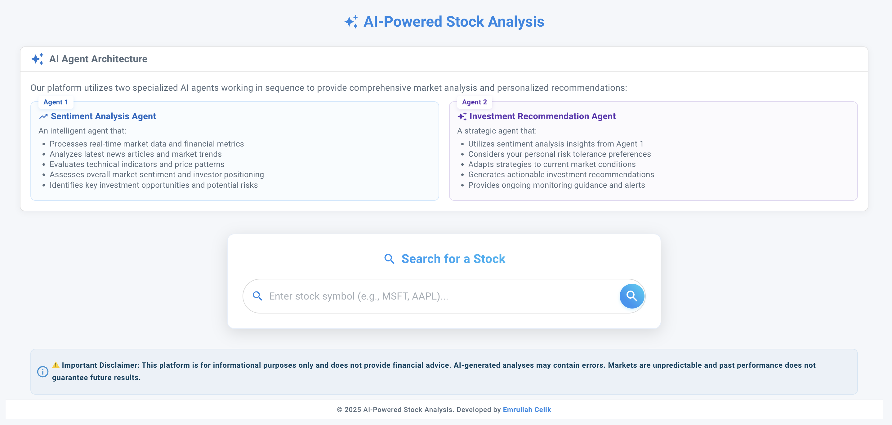

# AI-Powered Stock Market Analysis

A modern web application that provides AI-enhanced stock market analysis, sentiment evaluation, and investment recommendations.


*Main dashboard showing the stock search interface with AI-powered analysis capabilities*

## Features

- 📈 Real-time stock information and historical data visualization
- 🤖 AI-powered sentiment analysis of market trends
- 💡 Intelligent investment recommendations based on risk profile
- 📊 Interactive stock price charts with historical data
- 🔍 Smart stock search functionality with error handling
- 💫 Modern, responsive UI with Material Design

## Application Screenshots

### Stock Search and Analysis

*Smart stock search interface showing results for Microsoft (MSFT) with company information*


*Comprehensive stock analysis dashboard showing real-time price, market metrics, and interactive price history chart for Microsoft (MSFT)*

### AI-Powered Features

*AI-powered sentiment analysis showing detailed market insights, performance metrics, and technical indicators for Microsoft (MSFT)*


*Personalized investment recommendations based on user-defined risk level and investment horizon, providing detailed strategy analysis*

## Live Demo

- Frontend: [https://stock-screen-psi.vercel.app/](https://stock-screen-psi.vercel.app/)
- Backend API: [Render App URL]
- API Documentation: [Render App URL]/docs

> **Note:** The backend service is hosted on a free tier, which means it goes to sleep after periods of inactivity. When accessing the application for the first time, or after a period of inactivity, please allow 1-2 minutes for the backend to "wake up" and become responsive. Subsequent requests will be much faster as the backend remains active.

## Tech Stack

### Frontend
- React 18
- Material-UI (MUI)
- Chart.js for data visualization
- React Router for navigation
- Vite for build tooling

### Backend
- FastAPI
- OpenAI/Azure OpenAI for AI analysis
- yfinance for stock data
- Python 3.8+

## Prerequisites

- Node.js 16+
- Python 3.8+
- OpenAI API key or Azure OpenAI credentials
- NewsAPI key for sentiment analysis

## Installation

### Backend Setup

#### Python Installation (macOS)
1. Using Homebrew (recommended):
```bash
# Install Homebrew first if you don't have it
/bin/bash -c "$(curl -fsSL https://raw.githubusercontent.com/Homebrew/install/HEAD/install.sh)"

# Install Python
brew install python
```

2. Verify Python installation:
```bash
python3 --version
```

3. Create and activate the virtual environment:
```bash
# In the backend directory
python3 -m venv venv
source venv/bin/activate
```

4. Install requirements:
```bash
# Make sure you're in the backend directory and venv is activated
pip3 install -r requirements.txt

# If you encounter any missing package errors, install these packages specifically:
pip install fastapi==0.115.7
pip install "fastapi[all]"
pip install yfinance==0.2.52
pip install openai==1.60.1
pip install aiohttp
```

Note: Make sure to activate the virtual environment (`source venv/bin/activate`) every time you open a new terminal window to work on the backend.

### Frontend Setup
```bash
# In the frontend directory
npm install
```

### Environment Configuration

1. Create a `.env` file in the backend directory:
```env
# OpenAI Configuration (if using OpenAI directly)
OPENAI_API_KEY=your_openai_key_here

# Azure OpenAI Configuration (if using Azure OpenAI)
AZURE_API_KEY=your_azure_api_key_here
AZURE_ENDPOINT=https://your-resource-name.openai.azure.com
AZURE_MODEL_NAME=your-deployed-model-name

# Other APIs
NEWS_API_KEY=your_newsapi_key_here

# Security
SECRET_KEY=your_secret_key_here
```

2. Create a `.env.local` file in the frontend directory:
```env
VITE_API_URL=http://localhost:8003/api/v1
```

## Development

### Start the Backend Server
```bash
# Make sure you're in the backend directory and venv is activated
cd backend
source venv/bin/activate

# Start the server
python -m uvicorn app.main:app --reload --port 8003
```

The backend server will be available at:
- API: http://localhost:8003
- API Documentation: http://localhost:8003/docs
- Alternative API Documentation: http://localhost:8003/redoc
- Health Check: http://localhost:8003/health

### Start the Frontend Development Server
```bash
# In a new terminal window, navigate to the frontend directory
cd frontend

# Start the development server
npm run dev
```

The frontend application will be available at `http://localhost:5173`

Note: Both servers need to be running simultaneously for the application to work properly. Use separate terminal windows for the backend and frontend servers.

## Deployment

### Backend Deployment (Render)

1. Create a new Web Service on Render
2. Connect your GitHub repository
3. Configure the service:
   - Build Command: `pip install -r requirements.txt`
   - Start Command: `uvicorn app.main:app --host 0.0.0.0 --port $PORT`
4. Add Environment Variables:
   - All variables from `.env`
   - Set `PORT` to `10000`

### Frontend Deployment (Vercel)

1. Import your GitHub repository to Vercel
2. Configure the project:
   - Framework Preset: Vite
   - Build Command: `npm run build`
   - Output Directory: `dist`
3. Add Environment Variables:
   - `VITE_API_URL`: Your Render backend URL + `/api/v1`

## Project Structure

```
stock-screen/
├── frontend/
│   ├── src/
│   │   ├── components/        # Reusable UI components
│   │   ├── pages/            # Page components
│   │   ├── services/         # API services
│   │   ├── utils/            # Utility functions
│   │   └── assets/           # Static assets
│   └── public/               # Public assets
└── backend/
    ├── app/
    │   ├── main.py          # FastAPI application
    │   ├── services/        # Business logic
    │   ├── models/          # Data models
    │   └── core/            # Core configurations
    └── requirements.txt     # Python dependencies
```

## API Documentation

Once the backend is running, visit `http://localhost:8003/docs` for the interactive API documentation.

## Features in Detail

### Stock Information
- Real-time stock data including current price, volume, and market cap
- Historical price data visualization with interactive charts
- Company information and key statistics

### AI Analysis
- Sentiment analysis of market news and trends
- Investment recommendations based on user risk profile
- Technical analysis insights

The AI analysis provides:
- Overall market sentiment evaluation (Bullish/Bearish)
- Detailed performance metrics (5-day, 1-month, YTD)
- Technical analysis including moving averages and RSI
- Comprehensive market context and trends
- AI-generated insights based on current market conditions

The AI recommendations feature:
- Customizable risk level selection (Conservative to Aggressive)
- Flexible investment horizon options
- Detailed investment strategy analysis
- Company-specific growth opportunities
- Risk-adjusted recommendations based on market conditions

### User Experience
- Responsive design that works on desktop and mobile
- Intuitive stock search with error handling
- Clean and modern Material Design interface

## Disclaimer

This application is for informational purposes only and does not provide financial advice. AI-generated analyses may contain errors or inaccuracies. Please consult with a qualified financial advisor before making investment decisions.

## License

MIT License - feel free to use this project for your own purposes.

## Acknowledgments

- OpenAI/Azure OpenAI for AI capabilities
- yfinance for stock data
- Material-UI for the component library
- Chart.js for data visualization 