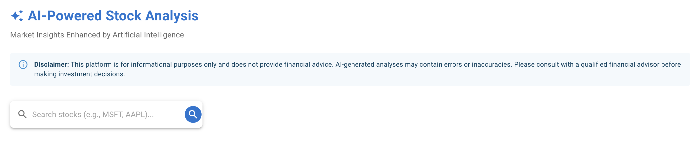

# AI-Powered Stock Market Analysis 📈

A sophisticated web application leveraging AI to provide comprehensive stock market analysis, sentiment evaluation, and personalized investment recommendations.


*AI-powered stock analysis dashboard with real-time market data and intelligent insights*

## 🌟 Key Features

### Real-Time Market Analysis
- Live stock data with price, volume, and market metrics
- Interactive price charts with historical data visualization
- Company information and key financial statistics

### AI-Powered Intelligence
- **Sentiment Analysis Agent**
  - Processes real-time market data and news
  - Analyzes technical indicators and trends
  - Evaluates market sentiment and positioning
  - Identifies key opportunities and risks

- **Investment Recommendation Agent**
  - Generates personalized investment strategies
  - Adapts to user's risk tolerance
  - Provides actionable entry/exit points
  - Monitors market conditions

### Modern User Experience
- Intuitive stock search with detailed results
- Responsive Material Design interface
- Real-time data updates
- Interactive charts and visualizations

## 🚀 Quick Start

### Prerequisites
- Node.js 16+ for frontend
- Python 3.8+ for backend
- Azure OpenAI API access
- NewsAPI key

### Frontend Setup
```bash
# Navigate to frontend directory
cd frontend

# Install dependencies
npm install

# Create environment file
cp .env.example .env.local

# Start development server
npm run dev
```

### Backend Setup
```bash
# Navigate to backend directory
cd azure-functions-backend

# Create virtual environment
python -m venv venv

# Activate virtual environment
source venv/bin/activate  # Unix/macOS
.\\venv\\Scripts\\activate  # Windows

# Install dependencies
pip install -r requirements.txt

# Create environment file
cp .env.example .env

# Start development server
func start
```

## 🔧 Configuration

### Frontend Environment Variables (.env)
```env
# API Configuration
VITE_API_URL=http://localhost:7071/api

# Development Settings
VITE_DEV_MODE=true
```

### Backend Environment Variables (.env)
```env
# Azure OpenAI Configuration
AZURE_API_KEY=your_azure_api_key_here
AZURE_ENDPOINT=https://your-resource-name.openai.azure.com/openai/deployments/your-deployment-name/chat/completions
AZURE_MODEL_NAME=gpt-4

# News API Configuration
NEWS_API_KEY=your_newsapi_key_here

# Security Settings
SECRET_KEY=your_secure_key_here
CORS_ORIGINS=http://localhost:5173,http://localhost:3000
```

## 🏗️ Project Structure

```
stock-screen/
├── frontend/                 # React + Vite frontend application
│   ├── src/
│   │   ├── components/      # Reusable UI components
│   │   ├── pages/          # Page components
│   │   ├── services/       # API services
│   │   └── utils/          # Utility functions
│   ├── public/             # Static assets
│   └── package.json        # Frontend dependencies
│
└── azure-functions-backend/ # Azure Functions backend
    ├── function_app.py     # Main application file
    ├── requirements.txt    # Python dependencies
    └── .env.example        # Environment variables template
```

## 🔄 Development Workflow

1. **Start Backend Server**
   ```bash
   cd azure-functions-backend
   source venv/bin/activate
   func start
   ```
   Backend will be available at:
   - API Endpoint: http://localhost:7071/api
   - Available Functions:
     - `/GetStockData`: Get real-time stock information
     - `/GetStockHistory`: Get historical price data
     - `/GetSentimentAnalysis`: Get AI-powered sentiment analysis
     - `/GetInvestmentRecommendation`: Get personalized investment recommendations
     - `/SearchStocks`: Search for stocks by symbol

2. **Start Frontend Development Server**
   ```bash
   cd frontend
   npm run dev
   ```
   Frontend will be available at http://localhost:5173

3. **Testing**
   ```bash
   # Frontend tests
   cd frontend
   npm run test

   # Frontend test coverage
   npm run coverage
   ```

## 📱 Features in Detail

### Stock Information
- Real-time price updates
- Historical price charts
- Technical indicators
- Company fundamentals
- Market statistics

### AI Analysis System
1. **Sentiment Analysis Agent**
   - Market news processing
   - Technical indicator analysis
   - Sentiment evaluation
   - Risk assessment

2. **Investment Recommendation Agent**
   - Strategy generation
   - Risk-adjusted recommendations
   - Entry/exit point suggestions
   - Portfolio considerations

### User Interface
- Modern Material Design
- Responsive layout
- Interactive charts
- Real-time updates
- Intuitive navigation

## 🚀 Deployment

### Frontend (Vercel)
1. Connect your GitHub repository
2. Configure build settings:
   ```
   Build Command: npm run build
   Output Directory: dist
   Framework Preset: Vite
   ```
3. Add environment variables from `.env.example`

### Backend (Azure Functions)
1. Create Azure Function App
2. Configure deployment:
   ```
   Runtime stack: Python
   Version: 3.8
   ```
3. Set up environment variables from `.env.example`
4. Enable CORS for frontend domain

## 🔒 Security Considerations

- API keys are stored securely in environment variables
- CORS is configured for specific origins
- Rate limiting is implemented on API endpoints
- Input validation on all user inputs
- Secure HTTPS communication

## 🤝 Contributing

1. Fork the repository
2. Create a feature branch
3. Commit your changes
4. Push to the branch
5. Create a Pull Request

## 📝 License

This project is licensed under the MIT License - see the [LICENSE](LICENSE) file for details.

### Third-Party Licenses

This project uses several third-party libraries and services, each with their own licenses:

#### Frontend Dependencies
- **React** - [MIT License](https://github.com/facebook/react/blob/main/LICENSE)
- **Material-UI** - [MIT License](https://github.com/mui/material-ui/blob/master/LICENSE)
- **Chart.js** - [MIT License](https://github.com/chartjs/Chart.js/blob/master/LICENSE.md)
- **Vite** - [MIT License](https://github.com/vitejs/vite/blob/main/LICENSE)
- **React Router** - [MIT License](https://github.com/remix-run/react-router/blob/main/LICENSE)
- **Axios** - [MIT License](https://github.com/axios/axios/blob/master/LICENSE)

#### Backend Dependencies
- **Python** - [PSF License](https://docs.python.org/3/license.html)
- **Azure Functions** - [MIT License](https://github.com/Azure/azure-functions-python-worker/blob/dev/LICENSE)
- **yfinance** - [Apache License 2.0](https://github.com/ranaroussi/yfinance/blob/main/LICENSE.txt)
- **pandas** - [BSD 3-Clause License](https://github.com/pandas-dev/pandas/blob/main/LICENSE)
- **numpy** - [BSD 3-Clause License](https://github.com/numpy/numpy/blob/main/LICENSE.txt)

#### API Services
- **Azure OpenAI** - Commercial License (Requires API key)
- **NewsAPI** - Commercial License (Requires API key)

### Usage Restrictions

When using this project, please be aware of the following:
1. The MIT License of this project applies to our original code
2. Third-party components are subject to their respective licenses
3. API services (Azure OpenAI, NewsAPI) require separate commercial agreements
4. Some dependencies may have usage restrictions or attribution requirements

For commercial use, ensure compliance with all third-party licenses and API terms of service.

## 🙏 Acknowledgments

- OpenAI/Azure OpenAI for AI capabilities
- NewsAPI for market news data
- Material-UI for components
- Chart.js for visualizations
- yfinance for stock data

## ⚠️ Disclaimer

This application is for informational purposes only. The AI-generated analyses and recommendations should not be considered as financial advice. Always consult with a qualified financial advisor before making investment decisions.

## 📞 Support

For support, please:
1. Check the [Issues](../../issues) section
2. Review existing documentation
3. Create a new issue if needed

---

Built with ❤️ using React, Python, and Azure OpenAI 