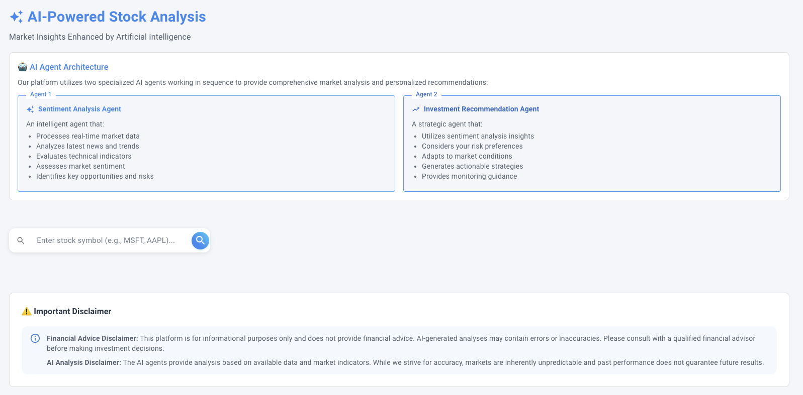

# AI-Powered Stock Market Analysis 📈

A sophisticated web application leveraging AI to provide comprehensive stock market analysis, sentiment evaluation, and personalized investment recommendations.


*AI-powered stock analysis dashboard showcasing real-time market data, sentiment analysis, and intelligent investment recommendations*

## 🌟 Key Features

### Real-Time Market Analysis
- Live stock data with price, volume, and market metrics
- Interactive price charts with historical data visualization
- Company information and key financial statistics
- Technical indicators and market trends
- Comprehensive financial metrics display

### AI-Powered Intelligence
- **Sentiment Analysis Agent**
  - Processes real-time market data and news
  - Analyzes technical indicators and trends
  - Evaluates market sentiment and positioning
  - Identifies key opportunities and risks
  - Provides comprehensive market context

- **Investment Recommendation Agent**
  - Generates personalized investment strategies
  - Adapts to user's risk tolerance
  - Provides actionable entry/exit points
  - Monitors market conditions
  - Risk-adjusted portfolio suggestions

### Modern User Experience
- Intuitive stock search with detailed results
- Responsive Material Design interface
- Real-time data updates
- Interactive charts and visualizations
- Seamless user interactions

## 🚀 Quick Start

### Prerequisites

#### Development Environment Setup
1. **Node.js 16+ for Frontend**
   - Download and install from [Node.js official website](https://nodejs.org/)
   - Verify installation: `node --version`
   - This will include npm (Node Package Manager) needed for frontend dependencies

2. **Python 3.8+ for Backend**
   - Download and install from [Python official website](https://www.python.org/downloads/)
   - Verify installation: `python3 --version`
   - Make sure pip (Python package manager) is included in the installation

#### API Access Setup
1. **Azure OpenAI API Access**
   - Sign up for [Azure OpenAI Service](https://azure.microsoft.com/en-us/products/ai-services/openai-service)
   - Follow the [Azure OpenAI deployment guide](https://learn.microsoft.com/en-us/azure/ai-services/openai/how-to/create-resource?pivots=web-portal):
     1. Create an Azure account if you don't have one
     2. Request access to Azure OpenAI Service
     3. Create an Azure OpenAI resource
     4. Deploy a model (we use GPT-4o)
     5. Get your API key and endpoint from the Azure portal

2. **NewsAPI Key**
   - Sign up at [NewsAPI.org](https://newsapi.org/register)
   - Get your API key from the [account dashboard](https://newsapi.org/account)
   - Free tier available for development (100 requests/day)
   - Consider paid tier for production use

### Backend Setup
```bash
# Navigate to backend directory
cd azure-functions-backend

# Create virtual environment
python3 -m venv venv

# Activate virtual environment
source venv/bin/activate  # Unix/macOS
.\\venv\\Scripts\\activate  # Windows

# Install dependencies
pip install -r requirements.txt

# Create environment file
cp .env.example .env

# Start development server
func start
```

### Frontend Setup
```bash
# Navigate to frontend directory
cd frontend

# Install dependencies
npm install

# Create environment file
cp .env.example .env.local

# Start development server
npm run dev
```

## 🔧 Configuration

### Frontend Environment Variables (.env)
```env
# API Configuration
VITE_API_URL=http://localhost:7071/api

# Development Settings
VITE_DEV_MODE=true
```

### Backend Environment Variables (.env)
```env
# Azure OpenAI Configuration
AZURE_API_KEY=your_azure_api_key_here
AZURE_ENDPOINT=https://your-resource-name.openai.azure.com/openai/deployments/your-deployment-name/chat/completions
AZURE_MODEL_NAME=gpt-4

# News API Configuration
NEWS_API_KEY=your_newsapi_key_here

# Security Settings
SECRET_KEY=your_secure_key_here
CORS_ORIGINS=http://localhost:5173,http://localhost:3000
```

## 🏗️ Project Structure

```
.
├── frontend/                      # React + Vite frontend application
│   ├── src/
│   │   ├── components/           # Reusable UI components
│   │   ├── pages/               # Page components
│   │   ├── services/            # API services
│   │   └── utils/               # Utility functions
│   ├── public/                  # Static assets
│   ├── .env.example             # Environment variables template
│   ├── package.json             # Frontend dependencies
│   ├── vite.config.js           # Vite configuration
│   ├── vercel.json              # Vercel deployment config
│   └── eslint.config.js         # ESLint configuration
│
├── azure-functions-backend/      # Azure Functions backend
│   ├── function_app.py          # Main application file with API endpoints
│   ├── requirements.txt         # Python dependencies
│   ├── .env.example            # Environment variables template
│   ├── host.json               # Azure Functions host configuration
│   └── local.settings.json     # Local development settings
│
├── docs/                        # Documentation
│   └── images/                 # Application screenshots and images
│
├── README.md                    # Project documentation
├── LICENSE                      # MIT license with terms
├── .env.example                # Root environment template
└── .gitignore                  # Git ignore rules
```

## 🔄 Development Workflow

1. **Start Backend Server**
   ```bash
   cd azure-functions-backend
   source venv/bin/activate
   func start
   ```
   Backend will be available at:
   - API Endpoint: http://localhost:7071/api
   - Available Functions:
     - `/GetStockData`: Get real-time stock information
     - `/GetStockHistory`: Get historical price data
     - `/GetSentimentAnalysis`: Get AI-powered sentiment analysis
     - `/GetInvestmentRecommendation`: Get personalized investment recommendations
     - `/SearchStocks`: Search for stocks by symbol

2. **Start Frontend Development Server**
   ```bash
   cd frontend
   npm run dev
   ```
   Frontend will be available at http://localhost:5173

## 📱 Features in Detail

### Stock Information
- Real-time price updates with dynamic refresh
- Interactive historical price charts with multiple timeframes
- Comprehensive technical indicators and analysis
- Detailed company fundamentals and metrics
- Advanced market statistics and trends
- Key financial ratios and performance indicators

### Stock Search & Discovery
- Smart search functionality with real-time suggestions
- Detailed company information in search results
- Quick access to key financial metrics
- Efficient stock symbol lookup
- Comprehensive market data preview

### AI Analysis System
1. **Sentiment Analysis Agent**
   - Real-time market news processing and analysis
   - Technical indicator pattern recognition
   - Market sentiment evaluation and scoring
   - Risk factor identification and assessment
   - News impact analysis and correlation
   - Trend identification and projection

2. **Investment Recommendation Agent**
   - Personalized strategy generation
   - Risk tolerance-based recommendations
   - Dynamic entry/exit point suggestions
   - Portfolio optimization guidance
   - Market condition monitoring
   - Risk-adjusted return analysis

### User Interface
- Clean, modern Material Design implementation
- Responsive layout for all device sizes
- Interactive data visualization
- Real-time updates and notifications
- Intuitive navigation and controls
- Seamless user experience
- Accessible design patterns

## 🚀 Deployment

### Frontend (Vercel)
1. Create a new project in Vercel
2. Configure build settings:
   ```
   Build Command: npm run build
   Output Directory: dist
   Framework Preset: Vite
   ```
3. Add environment variables from `.env.example`
4. Deploy your frontend code

### Backend (Azure Functions)
1. Create Azure Function App in your Azure portal
2. Configure deployment:
   ```
   Runtime stack: Python
   Version: 3.8
   ```
3. Set up environment variables from `.env.example`
4. Deploy your function code using Azure Functions Core Tools:
   ```bash
   cd azure-functions-backend
   func azure functionapp publish YOUR_FUNCTION_APP_NAME
   ```
5. Enable CORS for your frontend domain

## 🔒 Security Considerations

- API keys are stored securely in environment variables
- CORS is configured for specific origins
- Rate limiting is implemented on API endpoints
- Input validation on all user inputs
- Secure HTTPS communication

## 🤝 Contributing

1. Fork the repository
2. Create a feature branch
3. Commit your changes
4. Push to the branch
5. Create a Pull Request

## 📝 License & Legal Information

### Project Code License
The original code in this project is available under the MIT License. However, please note that this only applies to our original code contributions.

### Important License Considerations

This project incorporates various components with different licensing requirements:

#### Commercial API Services
- **Azure OpenAI Service**
  - Requires a paid subscription
  - Subject to Microsoft's commercial terms and conditions
  - Usage restrictions apply to AI-generated content

- **NewsAPI**
  - Requires a paid API key
  - Subject to NewsAPI's terms of service
  - Usage limitations based on subscription tier

- **Yahoo Finance Data (via yfinance)**
  - Data provided by Yahoo Finance is subject to Yahoo's terms of service
  - yfinance is licensed under Apache 2.0
  - Commercial usage may require direct agreement with Yahoo

#### Open Source Dependencies
Our project uses various open-source packages, each with their own licenses:

##### Frontend (MIT Licensed)
- React
- Material-UI
- Chart.js
- Vite
- React Router
- Axios

##### Backend
- Python (PSF License)
- Azure Functions (MIT)
- pandas (BSD 3-Clause)
- numpy (BSD 3-Clause)

### Legal Disclaimer

1. **Data Usage**: 
   - Financial data provided through this application comes from third-party sources
   - Users must comply with respective data providers' terms of service
   - Commercial use may require separate agreements with data providers

2. **API Services**:
   - Users must obtain their own API keys
   - Comply with all API service providers' terms and conditions
   - Monitor and adhere to usage limits and restrictions

3. **Open Source Components**:
   - Attribution requirements must be maintained
   - Some components may have additional restrictions
   - Modifications to open-source components must comply with their respective licenses

### Commercial Use Notice

For commercial use of this application, you must:
1. Obtain appropriate licenses for all API services
2. Ensure compliance with data providers' terms of service
3. Review and comply with all third-party component licenses
4. Consider obtaining legal advice for commercial deployment

For detailed terms of service and licensing information, please refer to each service provider's documentation:
- [Azure OpenAI Service Terms](https://azure.microsoft.com/en-us/support/legal/)
- [NewsAPI Terms](https://newsapi.org/terms)
- [Yahoo Finance Terms](https://legal.yahoo.com/us/en/yahoo/terms/otos/index.html)

## 🙏 Acknowledgments

- OpenAI/Azure OpenAI for AI capabilities
- NewsAPI for market news data
- Material-UI for components
- Chart.js for visualizations
- yfinance for stock data

## ⚠️ Disclaimer

This application is for informational purposes only. The AI-generated analyses and recommendations should not be considered as financial advice. Always consult with a qualified financial advisor before making investment decisions.

## 📞 Support

For support and troubleshooting:
1. Review the documentation sections above
2. Check your environment variables are properly configured
3. Ensure all dependencies are installed correctly
4. Verify API keys and services are active
5. Contact your system administrator or development team

---

Built with ❤️ using:
- Frontend: React, Vite, Material-UI, Chart.js
- Backend: Python, Azure Functions
- AI/ML: Azure OpenAI
- Data: NewsAPI, Yahoo Finance
- Development: Node.js, npm 